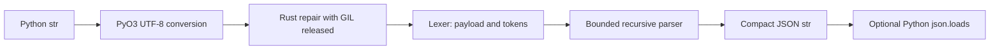

# Architecture and project flows

## Source map

| Path | Responsibility |
| --- | --- |
| `src/lexer.rs` | Byte cursor, token boundaries, BOM/fence trimming, comment skipping, preamble scanning |
| `src/parser.rs` | Container repair, string escaping, literal/number normalization, nesting bound |
| `src/lib.rs` | PyO3 bindings, Python errors, GIL release, version and depth metadata |
| `python/repairjson/` | Explicit Python exports and packaged typing information |
| `python/tests/` | Installed API regressions and generated invariants |
| `benchmark.py` | Reproducible synthetic throughput comparison |
| `.github/workflows/CI.yml` | Validation, platform builds, trusted publication |

## Repair flow

1. PyO3 accepts a Python Unicode string and borrows its UTF-8 representation.
2. The wrapper detaches from the Python interpreter while Rust performs repair, allowing other Python threads to run.
3. The lexer trims a BOM and surrounding fences, then searches outside quotes for an object or array payload.
4. A bounded recursive-descent parser writes compact JSON into one output buffer. Each container consumes its own closing delimiter; an encountered parent delimiter is left for the parent.
5. Strings share one escaping routine. Numbers are validated before being normalized directly into the output buffer, without a per-number allocation or floating-point conversion.
6. A successful result becomes a Python string. `loads()` additionally calls Python's `json.loads()` after reattaching. Depth-limit and ambiguous-quote errors become `ValueError`.

The main lexer cursor only advances. The preamble scan and limited lookahead for missing-comma keys can revisit bytes; this is not a strict one-pass parser. Time is linear in input length, with memory proportional to input/output size and bounded native recursion. Parser state is local to each call; no unsafe Rust or global mutable state is used in this crate.

The UTF-8 boundary rejects raw lone Python surrogates before the parser runs. Inside Rust, string traversal may visit individual bytes, but only ASCII syntax is removed or inserted; complete non-ASCII sequences remain in the output. A truncation received as a Python `str` is already valid UTF-8, while JSON escape text such as `\ud800` can still decode to a surrogate in Python.

Expected parser failures return a Rust `Result` and become Python `ValueError`. PyO3's [panic boundary](https://github.com/PyO3/pyo3/blob/v0.29.2/src/panic.rs) converts an unexpected unwinding Rust panic into `PanicException`, which derives from `BaseException`; a normal `except Exception` does not catch it. This is a last-resort boundary, not a recovery guarantee. The subprocess regression runs [the configurable input checker](../scripts/check_inputs.py), fails on an uncaught panic, process abort, invalid output, or timeout, and checks that documented errors leave the extension usable. Native stack overflow and an allocator abort are not catchable Python exceptions; the depth bound addresses stack recursion, while callers must bound input sizes. No panic is deliberately injected into the public API.

## Design boundaries

The engine repairs syntax without understanding a schema. It produces one plausible value rather than an edit log. The [behavior reference](behavior.md) documents lossy choices. A stable-ABI extension keeps wheel count small while supporting CPython 3.8 and newer. The native Rust API is not published as a separate supported crate.

## Validation and publication

Rust unit tests exercise low-level behavior. Python tests run through the installed extension, including generated checks for valid-JSON preservation, idempotence, malformed text, and truncation. Additional regressions cover concurrency, Unicode, escaping, API errors, metadata, and type files.

CI checks formatting, lints, the minimum Rust version, multiple Python versions, native wheels, and source-distribution installation. The benchmark's integrity tests run without installing its optional comparison dependency. Source distributions also include the benchmark and local demo. Tagged releases publish only after those checks and all platform builds pass. See the [release guide](releases.md).
